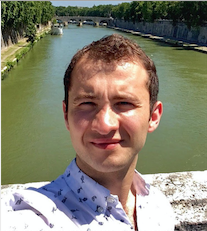

        
        
        
        
        
 

  

  

Hi, I’m Ellis.

I have research interests in the Philosophy of Mind, Ancient Philosophy, and the Philosophy of Physics.

This website is an online home which has helped shape my thinking <a href ="https://ellis.bio/posts/my-top-10-books-of-2023" style="color:tomato">[1]</a>, <a href ="https://ellis.bio/posts/on-being-nudged" style="color:tomato">[2]</a>, <a href ="https://ellis.bio/posts/leibniz-and-the-machine" style="color:tomato">[3]</a>; it holds my reading list <a href ="https://ellis.bio/tag/reading/" style="color:tomato">[4]</a>; some (very bad) artwork <a href ="https://ellis.bio/posts/sketchbook" style="color:tomato">[5]</a>, <a href ="https://ellis.bio/art" style="color:tomato">[6]</a>; and favourite quotes <a href ="https://ellis.bio/quotes" style="color:tomato">[7]</a>. I currently live in London, and I studied at the London School of Economics.
